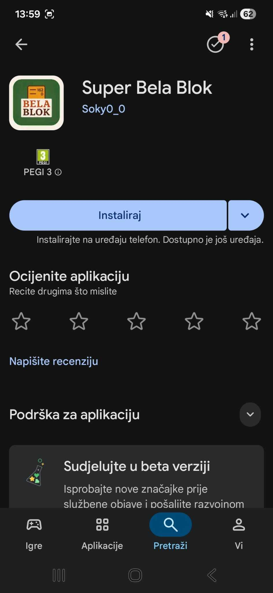
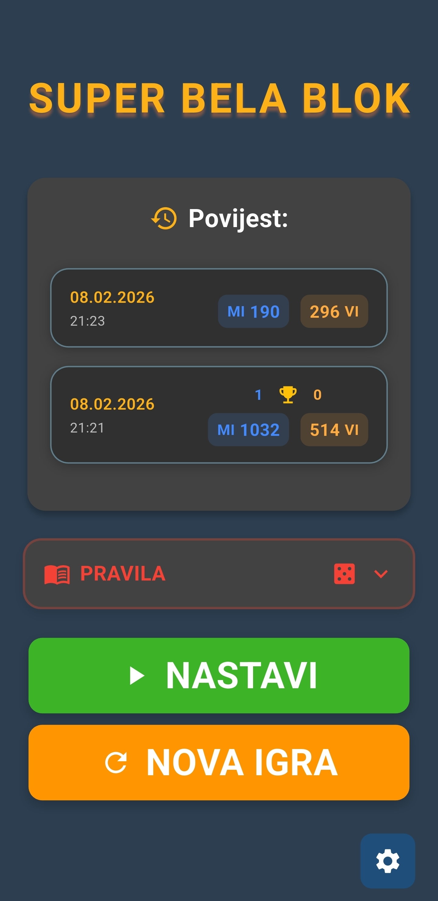
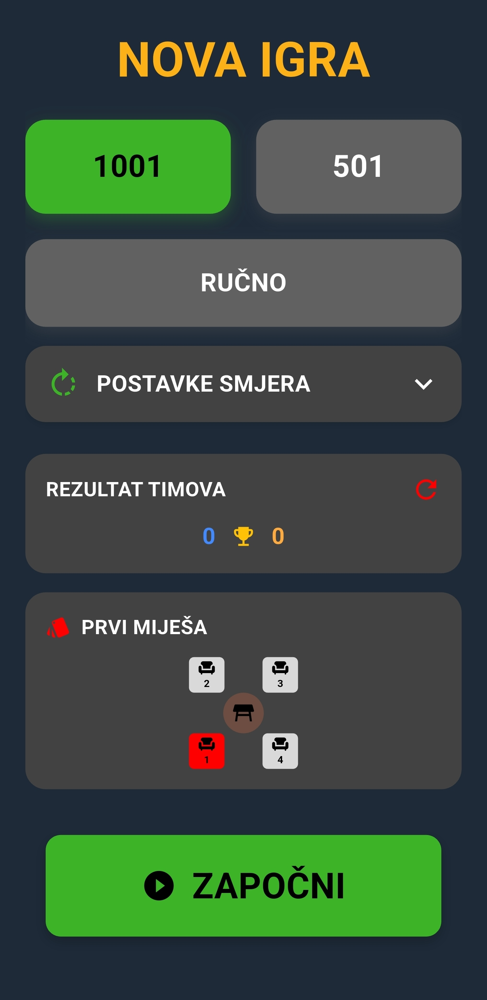
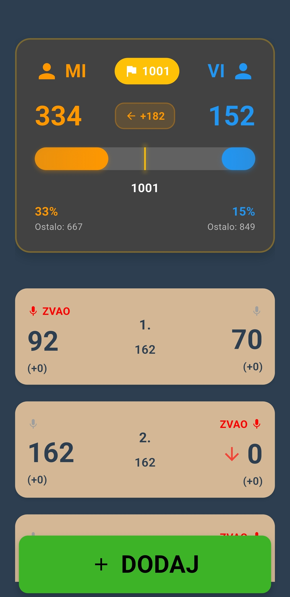
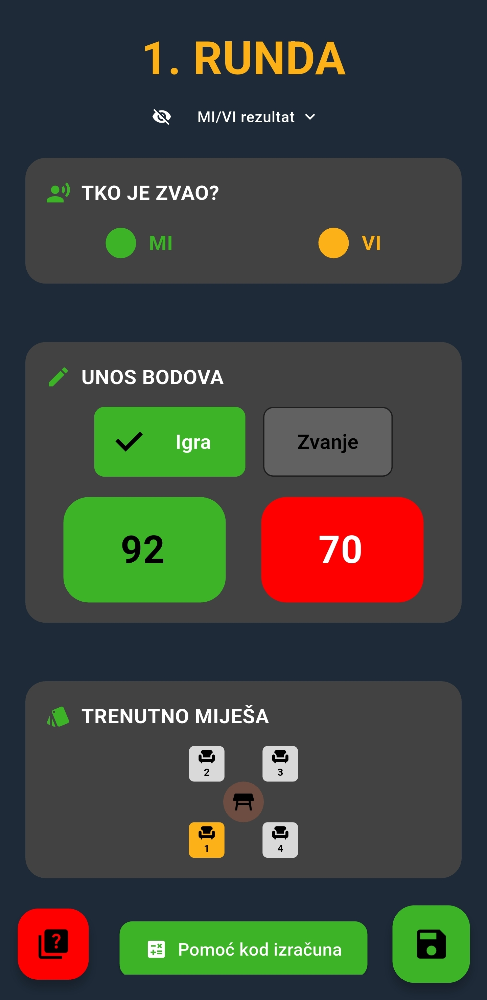
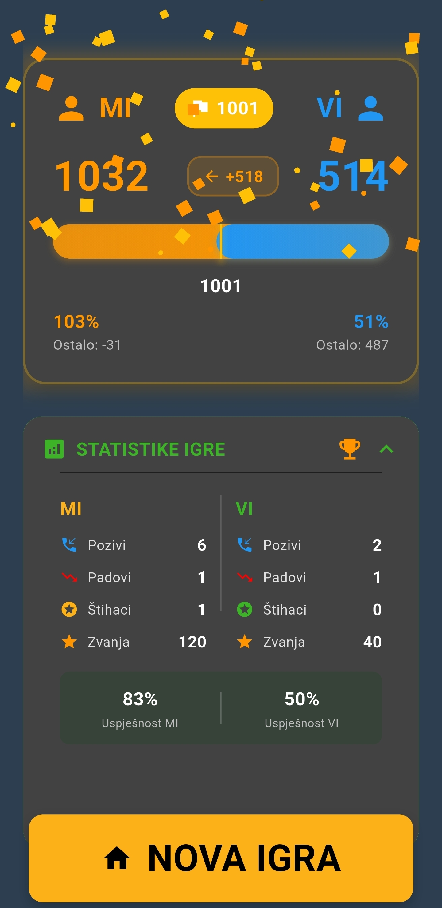

# Super Bela Blok - Flutter App

**Super Bela Blok** je moderna aplikacija za praćenje i bilježenje rezultata u igri kartama **Bela**, osmišljena kako bi igru učinila jednostavnijom, preglednijom i ugodnijom za sve igrače.

<p align="center">
  
  
  
  
  
  
</p>

<p align="center">
  <a href="https://play.google.com/store/apps/details?id=io.github.vuk7.belablok">
    
  </a>
</p>

### Glavne značajke
- Praćenje igara u stvarnom vremenu
- Povijest odigranih igara
- Praćenje tko miješa karte
- Praćenje pobjeda i statistike timova
- Tamna i svijetla tema
- Ugrađena pravila igre Bela
- Pomoć pri zvanju
- Detaljna statistika igre
- Pametni kalkulator bodova
- Mogućnost promjene smjera igre

---

Card game "Bela" (Belot) score tracking application developed in Flutter with Drift ORM database.

### Key features
- Real-time game score tracking
- Game history overview
- Card shuffler tracking
- Team win tracking and statistics
- Dark and light theme support
- Built-in Bela game rules
- Bidding (calling) assistance
- Detailed game statistics
- Smart score calculator
- Ability to change game direction

**Documentation and codebase are in English.**

## How to start this project

### Prerequisites

Before running the project, make sure you have the following components installed:

- [Flutter SDK](https://flutter.dev/docs/get-started/install) (version 3.5.4 or newer)
- [Dart SDK](https://dart.dev/get-dart) (included with Flutter)
- [Android Studio](https://developer.android.com/studio) or [VS Code](https://code.visualstudio.com/) with Flutter extensions
- [Git](https://git-scm.com/)

### Installation check

```bash
flutter doctor
```

### 1. Go inside ``src`` directory

```bash
cd src
```

### 2. Install dependencies

```bash
flutter pub get
```

### 3. Run application

```bash
flutter run
```

## Database migrations

The project uses Drift ORM for database management. You need to generate code for database operations (when making changes to table definitions):

```bash
flutter pub run build_runner build
```

For continuous watching during development:

```bash
flutter pub run build_runner watch
```

If there are conflicts with already generated files:

```bash
flutter pub run build_runner build --delete-conflicting-outputs
```

## 🤝 Contributing

Thank you for your interest in contributing! Follow these steps to get started:

1. Fork the repository on GitHub
2. Open an issue describing the feature or bug you’re addressing
2. Create a new branch (`git checkout -b feature/AmazingFeature`)
3. Make your changes and commit (`git commit -m 'Add some AmazingFeature'`)
4. Push your branch to your fork (`git push origin feature/AmazingFeature`)
5. Open a Pull Request and link it to the original issue

---
